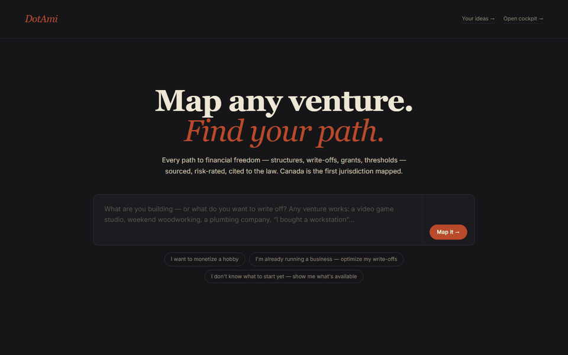
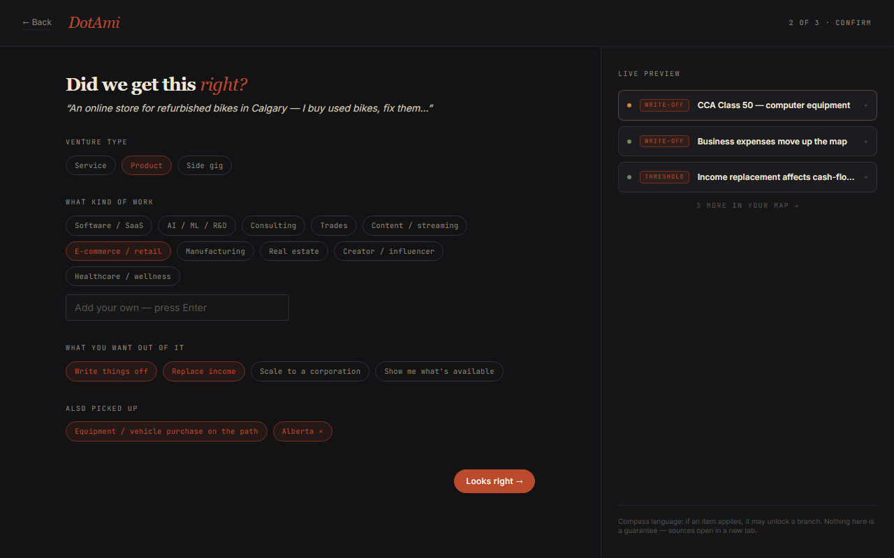
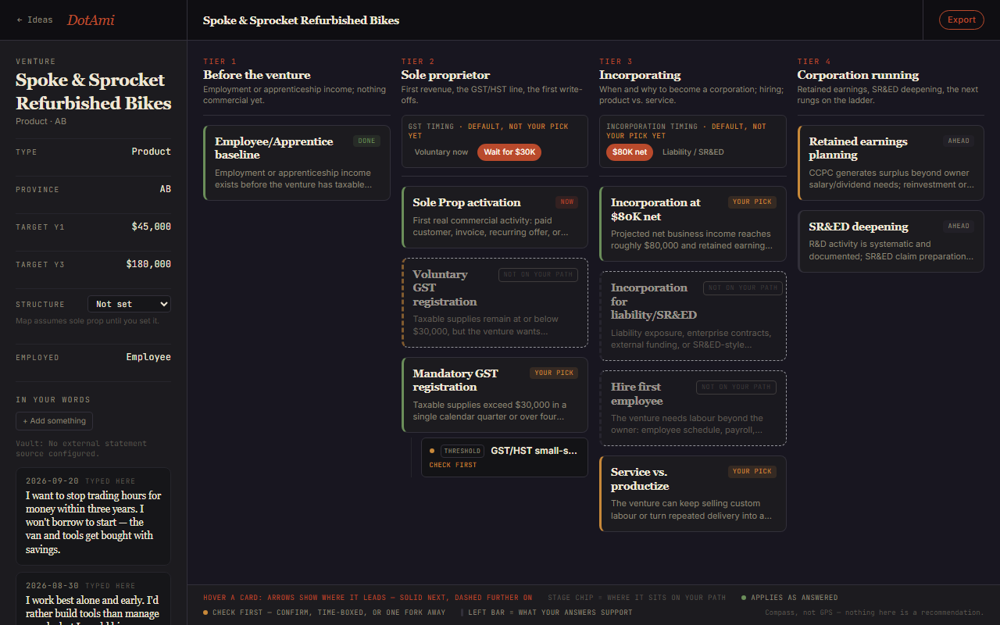
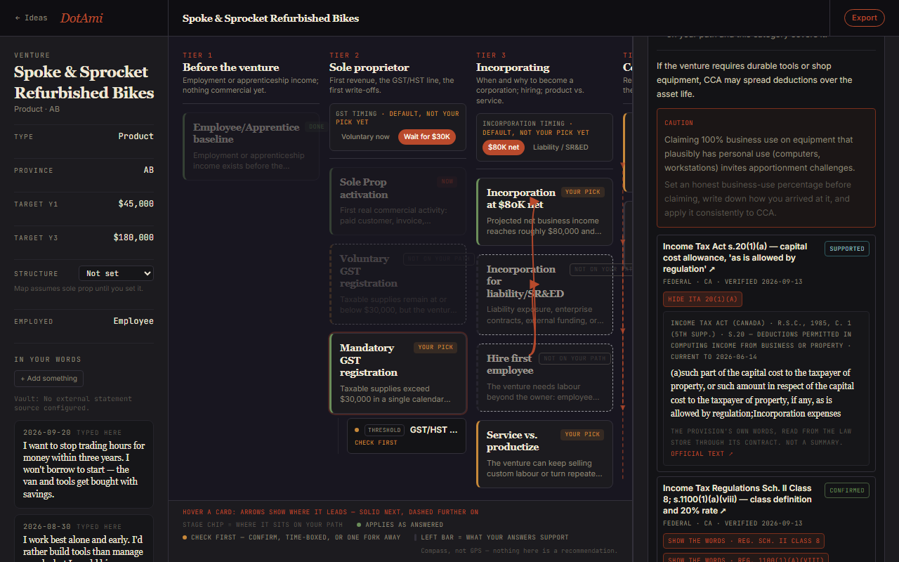

# DotAmi

**Every path to financial freedom, mapped step by step and cited to the law — open source,
community-curated, so everyone has access to the same tools, tactics and tricks the elite have.**

## Mission

The people with the best accountants and lawyers already know which structures, write-offs,
thresholds, elections and strategies apply to them, and in what order. Everyone else finds
out late, or never. DotAmi exists to close that gap: **any and all paths that lead to
financial freedom, shown in the open**, each step with the statute or official page that
makes it work one click away. Not the biggest list — the most relevant. Not advice — the map,
with the sources, so you walk into your accountant's office knowing what to ask.

Describe what you want to build. DotAmi maps the lifecycle in front of you as tier columns
of cards — for a Canadian venture today: sole proprietor → GST/HST → incorporation → the
corporation running. Each card is a step or a lever (a write-off, a grant, a threshold, a
structure choice), lit by a deterministic rules engine from the answers *you* gave, with the
law behind it one click away.

> **DotAmi is information, not legal or tax advice.** It is a prep tool for you and your
> accountant and lawyer. It never files anything, never generates a binding document, and
> never claims a qualification. Every figure it shows carries its source and the date it was
> last verified — check that date before you rely on it.

## See it



*A made-up venture on an empty database, with no API key: the keyword parser and the rules
engine did all of it. About 25 seconds, loops.*

| Confirm what was understood | The map | The law, in its own words |
|---|---|---|
|  |  |  |

## What it does

- **Intake → map.** Three screens (about you · confirm what you're building · where it
  operates) and the map opens. Nothing is pre-filled; blank stays blank.
- **The map.** Tier columns of stage cards and lever cards. A card says *applies* only when
  the rules engine says your answers meet the conditions; *check first* when it is
  plausible, time-boxed, or one decision away. Hover a card to see where it leads.
- **The law, on the card.** Every catalog entry cites the statute, the regulation or the tax
  authority's own page (today: the Income Tax Act, the Regulations, CRA and provincial
  sources), with a verification status and a `lastVerified` date.
- **Your ideas.** Save as many ventures as you like, stage them (idea → prototype → first
  customers → established), cross-reference the ones that overlap or could become sister
  companies.
- **Your words.** What you tell it about yourself is kept as dated statements in your own
  words — never summarised into a profile, never used to rank anything.
- **Your data stays yours.** Self-hosted, on your machine, in a database you own. Nothing
  is sent anywhere — not even a font request: every asset is served from your own machine.

## What it does not do (on purpose)

- It does not recommend. "If X, this may unlock Y" — never "you should".
- It does not invent numbers. No projections, no dollar ranges without a sourced figure.
- It does not run a model over your data. Node states, unlocks and risk reads are
  deterministic TypeScript over versioned catalogs. The only optional model call is the
  intake's free-text parser, and it has a keyword fallback.
- It does not file, sign, or submit anything.
- It does not hide the risk. Every lever carries its audit exposure and anti-avoidance read,
  stated plainly — the reader decides.

## Coverage today

**Canada is the first jurisdiction mapped:** federal + Alberta, British Columbia and Ontario
catalog entries; all 13 provinces and territories selectable, everywhere else in Canada gets
federal rules and an honest "provincial coverage pending" badge. **Every other country is
unmapped.** The catalogs are keyed by jurisdiction; a new one starts as a roadmap issue and
lands as cited nodes. **This is the part that needs you** — see
[CONTRIBUTING.md](CONTRIBUTING.md).

## Where this is going

[docs/roadmap.md](docs/roadmap.md) — roadmaps as data (one cited markdown file per node),
progress per venture, jurisdictions beyond Canada, connecting to accounting software and
financial records **locally**, and complex tax strategies and business structures mapped as
roadmaps of their own. Pick something up.

## Run it

Requires Node 20+, PostgreSQL 15+ (Docker is fine), and `npm`.

```bash
cp .env.example .env          # set DATABASE_URL
npm ci
npm run prisma:deploy         # applies the migrations to your database
npm run dev                   # http://localhost:3000
```

Self-hosted, single user, no auth — run it on your own machine. A hosted multi-user
instance needs authentication and tenant isolation that do not exist yet.

The quality gate is `npm run ci:quality` (prisma generate → typecheck → lint → test → build);
CI runs the same chain on every pull request.

## Contribute

Any path to financial freedom you can cite: a jurisdiction, a structure, a strategy, a
write-off, a grant, a threshold, a correction, a fresher `lastVerified` date. The style guide
and the rules are in [CONTRIBUTING.md](CONTRIBUTING.md). Short version: one paragraph per
node, typed sources in a fixed order, **no entry without a citation**, nothing you have not
verified yourself, no self-promotion. Sign your commits off with the [DCO](DCO.md)
(`git commit -s`).

## Licenses

- Code: [Apache License 2.0](LICENSE).
- Content — catalog entries, roadmap nodes, documentation under `docs/`:
  [Creative Commons Attribution-ShareAlike 4.0](LICENSE-CONTENT.md).
- Canadian statutes and regulations quoted or cited are reproduced under the
  [Reproduction of Federal Law Order](https://laws-lois.justice.gc.ca/eng/regulations/SI-97-5/)
  and the equivalent provincial terms; CRA pages are linked, not copied. Other jurisdictions'
  texts follow their own official reproduction terms as they are added.

## Where things live

| | |
|---|---|
| Engine catalogs (the data) | `lib/engines/<engine>/v2026/` — write-offs, grants, compliance, structure, templates, risk, the lifecycle (CFE) |
| The rules engine | `lib/brain/` |
| The map | `components/cockpit/` · tiers in `lib/engines/cfe/v2026/tiers.ts` |
| Per-control behaviour of every screen | `docs/ui-spec/` |
| Catalog conventions (read before editing a catalog) | `docs/engines/README.md` |
| Architecture | `docs/architecture/` |
| Where this is going | `docs/roadmap.md` |
| Screenshots and the GIF above | `docs/media/` — from a made-up venture on an empty database |
