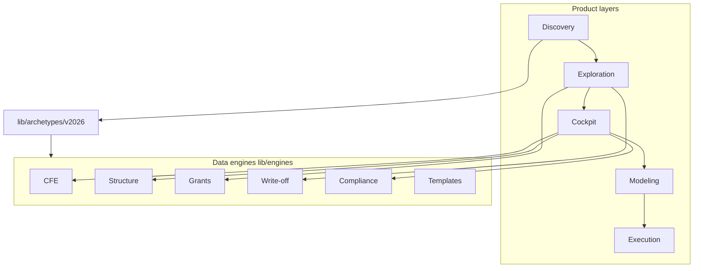

# DotAmi Architecture Overview

Last updated: 2026-06-08

## Layer map



## Routes

| Route | Layer | Key components |
|-------|-------|----------------|
| `/` | Discovery | `components/discovery/landing-page` |
| `/intake` | Discovery | `components/discovery/intake-page` |
| `/explore` | Exploration | `components/exploration/exploration-page` |
| `/cockpit` | Cockpit | `components/cockpit/cockpit-page` |

## Folder layout

```
lib/
  engines/
    shared/types.ts       # EngineCitation, EngineCatalog, Province
    cfe/v2026/            # lifecycle nodes
    structure/v2026/      # entity ladder
    grants/v2026/
    writeoffs/v2026/
    compliance/v2026/
    templates/v2026/
    index.ts              # barrel export
  paths/v2026/            # exploration path catalog + scoring
  scenarios/              # user scenario state (Postgres-backed)
  journey/                # cross-route intake draft (sessionStorage)
  cfe/                    # shim re-export → engines/cfe (legacy imports)

components/
  discovery/
  exploration/
  cockpit/
  shared/                 # ui primitives, journey-provider
  node-detail-panel.tsx
  lens-chat-panel.tsx
  playbook-export-panel.tsx
```

## State boundaries

- **Engines:** read-only catalogs; never in Postgres
- **Scenario:** user profile + branch state in Postgres via Prisma
- **Journey draft:** intake + archetype selection in sessionStorage

## Stack

Next.js 14 App Router, TypeScript, Tailwind, Prisma, PostgreSQL, React Flow, dagre, Recharts, Anthropic Haiku (Lens), Vercel.
